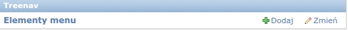
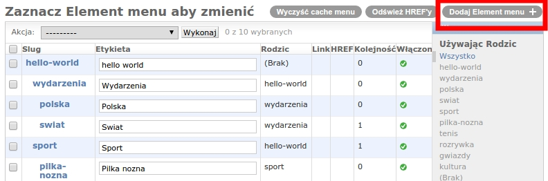
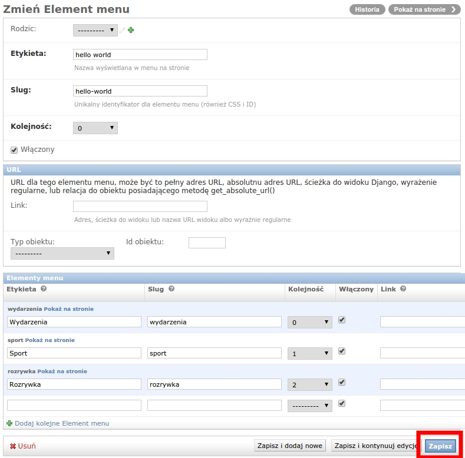

Dokumentacja funkcjonalna
=========================

W tej dokumentacji dowiesz się jak dodawać komponenty do treenav'a oraz za co każdy atrybut odpowiada.

Sposób używania treenav'a
-------------------------

Aby dodać elementy treenav'a należy:

- 1. Wejść w kategorie aplikacji w panelu admina (/admin):

- 2.Kliknać w przycisk "Dodaj Element menu +"

- 3. Wypełnić potrzebne pola danymi i klikać zapisz.
   Przykładowe wypełnienie:

- 4. Aby używać treenav'a w szablonie należy załadować *treenav_tags* oraz użyć tag *show_treenav* z argumentem, który jest Slug'iem do najwyższego poziomu (rodzica) w menu, np.
    
    ``
    ``

Opis atrybutów
--------------

:Rodzic: Wskazuje na rodzica w drzewiastej reprezentacji naszego menu.

:Etykieta: Nazwa wyświetlana na stronie.

:Slug: Unikalna nazwa naszego elementu menu. Dzięki Slug możemy tworzyć unikalne url'e o *ładnej* nazwie, a nie np. za pomocą id.

:Kolejność: Kolejnośc naszego elementu w menu.

:Włączony: Czy element jest widoczny na naszej stronie.

:Elementy menu: Tutaj możemy w szybki sposób dodać dzieci do naszego elementu zamiast od nowa dodawać je za pomocą *Dodaj Element menu*.
